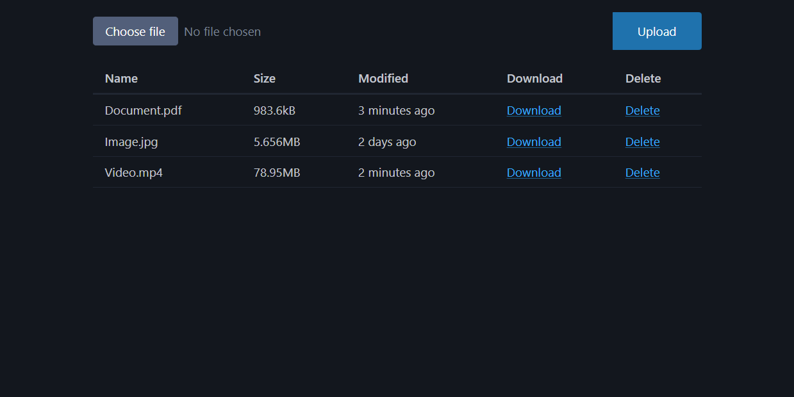
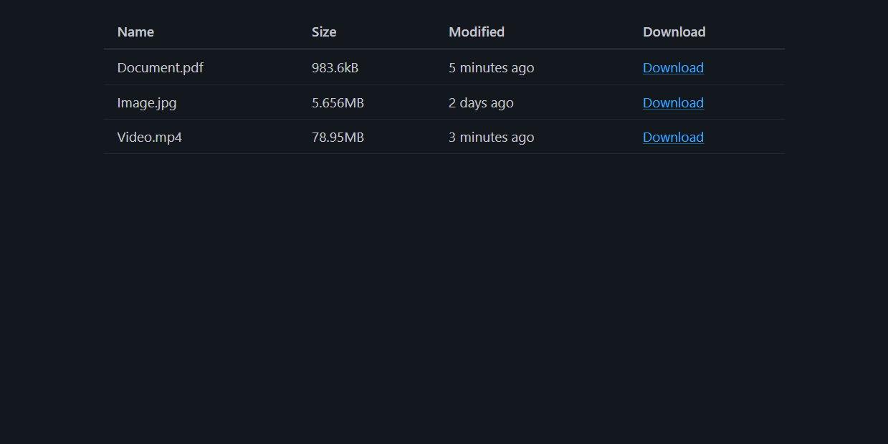

<div align=center>

# file-server

## HTTP/TUS file server

</div>

## Usage

-   ```
    docker run -d -e MANAGE_TOKEN="{MANAGE_TOKEN}" -e VIEW_TOKEN="{VIEW_TOKEN}" --name file-server -p 1323:1323 -v ./files:/files ljstadler/file-server:latest
    ```
-   Go to `{HOST}:{PORT}/files?auth={AUTH}` using either the `MANAGE_TOKEN` or `VIEW_TOKEN`

## Screenshots

### Manage



### View


